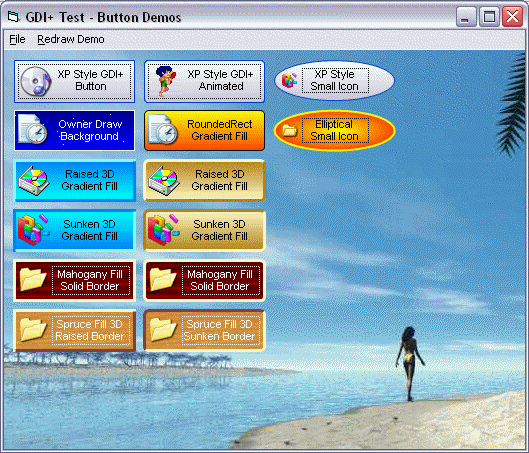



## Wrappers for GDI\+ RoundedRectangle, Ellipse

### Description

Demo consists if 4 GDI+ wrappers: DrawGDIPEllipse, DrawGDIPFocusRect,

DrawGDIPFormattedText, DrawGDIPMultiStyleRectangle. These wrappers could be used to

make a super button control. Must have GDI+ installed. See

http://www.planet-source-code.com/vb/scripts/ShowCode.asp?txtCodeId=37541&lngWId=1
 
### More Info
 
GDI+ must be installed. See

http://www.planet-source-code.com/vb/scripts/ShowCode.asp?txtCodeId=37541&lngWId=1

             |
---                |---
**Submitted On**   |2002-09-04 23:14:26
**By**             |[Dana Seaman\_](https://github.com/Planet-Source-Code/PSCIndex/blob/master/ByAuthor/dana-seaman.md)
**Level**          |Intermediate
**User Rating**    |4.4 (31 globes from 7 users)
**Compatibility**  |VB 5\.0, VB 6\.0
**Category**       |[Graphics](https://github.com/Planet-Source-Code/PSCIndex/blob/master/ByCategory/graphics__1-46.md)
**World**          |[Visual Basic](https://github.com/Planet-Source-Code/PSCIndex/blob/master/ByWorld/visual-basic.md)
**Archive File**   |[Wrappers\_f126890942002\.zip](https://github.com/Planet-Source-Code/dana-seaman-wrappers-for-gdi-roundedrectangle-ellipse__1-38644/archive/master.zip)

